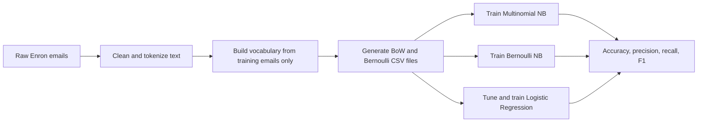

# MailGuard

### From-Scratch Email Spam Classification with Naive Bayes and Logistic Regression

MailGuard is an interpretable machine-learning project that classifies email as **ham** (legitimate) or **spam** using three algorithms implemented from scratch:

- Multinomial Naive Bayes with Bag-of-Words features
- Bernoulli Naive Bayes with binary word-presence features
- L2-regularized Logistic Regression with both feature representations

The experiments use the Enron1, Enron2, and Enron4 email datasets. The complete pipeline starts with raw email text, creates leakage-safe training vocabularies, converts messages into numerical CSV feature matrices, trains each classifier, and reports accuracy, precision, recall, and F1-score.

> Recommended GitHub project name: **MailGuard - From-Scratch Email Spam Classification**  
> Recommended repository slug: `mailguard-spam-classifier`

## Contents

- [Project at a glance](#project-at-a-glance)
- [Workflow](#workflow)
- [Repository structure](#repository-structure)
- [How the pipeline works](#how-the-pipeline-works)
- [Setup](#setup)
- [Recreate the project](#recreate-the-project)
- [Run the classifiers](#run-the-classifiers)
- [Validate the outputs](#validate-the-outputs)
- [Results](#results)
- [Implementation details](#implementation-details)
- [Reproducibility notes](#reproducibility-notes)
- [Supporting documents](#supporting-documents)
- [Academic reference](#academic-reference)

## Project at a glance

| Item | Details |
| --- | --- |
| Problem | Binary email spam classification |
| Positive class | `1 = spam` |
| Negative class | `0 = ham` |
| Datasets | Enron1, Enron2, Enron4 |
| Feature representations | Bag of Words and Bernoulli presence/absence |
| Models | Multinomial NB, Bernoulli NB, Logistic Regression |
| Core implementation | Python and NumPy; no scikit-learn model APIs |
| Text processing | NLTK tokenization and English stopword removal |
| Evaluation metrics | Accuracy, precision, recall, F1-score, confusion-matrix counts |
| Tested runtime | Python 3.13.7, NumPy 2.3.3, NLTK 3.9.1 |

### Dataset summary

The checked-in raw email folders contain the following messages. The generated CSV dimensions are included as a quick integrity reference.

| Dataset | Train ham | Train spam | Test ham | Test spam | Vocabulary features | Train rows | Test rows |
| --- | ---: | ---: | ---: | ---: | ---: | ---: | ---: |
| Enron1 | 319 | 131 | 307 | 149 | 3,701 | 450 | 456 |
| Enron2 | 340 | 123 | 348 | 130 | 3,666 | 463 | 478 |
| Enron4 | 133 | 402 | 152 | 391 | 6,010 | 535 | 543 |

Each dataset has four generated files: BoW train/test and Bernoulli train/test, for a total of 12 CSV files.

## Workflow



## Repository structure

```text
.
├── 1_data_preparation/
│   ├── data_exploration.py
│   ├── text_preprocessor.py
│   ├── vocabulary_builder.py
│   ├── feature_matrix_generator.py
│   └── enron*_vocabulary.pkl
├── 2_multinomial_naive_bayes/
│   └── multinomial_naive_bayes.py
├── 3_bernoulli_naive_bayes/
│   └── bernoulli_naive_bayes.py
├── 4_logistic_regression/
│   └── logistic_regression.py
├── 5_validation_and_testing/
│   ├── algorithm_validation.py
│   ├── csv_validator.py
│   ├── full_label_check.py
│   └── label_investigation.py
├── dataset/
│   ├── enron1_train/ ... enron1_test/
│   ├── enron2_train/ ... enron2_test/
│   └── enron4_train/ ... enron4_test/
├── generated_datasets/
│   └── 12 feature-matrix CSV files
├── project_1_readme.pdf
├── Project_Report.pdf
└── Readme.pdf
```

The included `spam_classifier_env/` directory is a local Windows virtual environment, not part of the source implementation. For a clean GitHub repository, recreate a virtual environment instead of committing the existing environment directory.

## How the pipeline works

### 1. Text preprocessing

`EmailPreprocessor` applies the same transformations to training and test emails:

1. Convert text to lowercase.
2. Remove common email headers such as `Subject`, `From`, `To`, and `Date`.
3. Remove forwarded-message separators, URLs, email addresses, digits, punctuation, and excess whitespace.
4. Tokenize with NLTK's `word_tokenize`.
5. Remove English stopwords.
6. Keep alphabetic tokens longer than two characters.

The vocabulary is built from the training folders only. Words must occur at least twice across the training emails to be retained, and the final vocabulary is sorted for deterministic feature-column order. Test emails are transformed with the already-built training vocabulary; unseen test words are ignored.

### 2. Feature generation

For every dataset and split, the feature generator writes a CSV with one row per email and a final `label` column.

- **BoW:** each feature stores the number of times the vocabulary word occurs in the email.
- **Bernoulli:** each feature is `1` when the word appears at least once and `0` otherwise.

The generated filenames follow the required convention:

```text
<dataset>_<representation>_<split>.csv
```

Examples:

```text
enron1_bow_train.csv
enron1_bernoulli_test.csv
enron4_bow_test.csv
```

### 3. Model training and evaluation

All models use `spam = 1` as the positive class. The evaluation code computes:

- Accuracy: proportion of all correctly classified emails
- Precision: proportion of predicted spam that is actually spam
- Recall: proportion of actual spam detected
- F1-score: harmonic mean of precision and recall

## Setup

Python 3.9 or newer is required. The clean setup below is recommended for a new clone.

### Windows PowerShell

Run these commands from the project root:

```powershell
python -m venv .venv
.\.venv\Scripts\Activate.ps1
python -m pip install --upgrade pip
python -m pip install numpy nltk
python -m nltk.downloader punkt punkt_tab stopwords
```

If PowerShell blocks activation, run the scripts with the virtual-environment interpreter directly, for example:

```powershell
.\.venv\Scripts\python.exe -X utf8 "2_multinomial_naive_bayes\multinomial_naive_bayes.py"
```

The project intentionally does not require scikit-learn, TensorFlow, or another high-level machine-learning library. The learning algorithms and optimization steps are implemented in the repository source.

## Recreate the project

The raw dataset folders and generated CSV files are already included in this project. To rebuild the preprocessing artifacts from the raw email folders, run the following from the project root:

```powershell
Set-Location "1_data_preparation"
..\.venv\Scripts\python.exe -X utf8 vocabulary_builder.py
..\.venv\Scripts\python.exe -X utf8 feature_matrix_generator.py
Set-Location ..
```

This performs the following work:

1. Loads the Enron1, Enron2, and Enron4 train/test folder paths.
2. Builds one vocabulary per dataset from training emails only.
3. Saves `enron1_vocabulary.pkl`, `enron2_vocabulary.pkl`, and `enron4_vocabulary.pkl` in `1_data_preparation/`.
4. Generates all 12 CSV feature matrices in `generated_datasets/`.

The working-directory detail matters because the current vocabulary loader looks for the pickle files in the process's current directory. Running both preparation scripts from `1_data_preparation/` keeps the artifacts in their intended location.

## Run the classifiers

Run these commands from the project root. The `-X utf8` flag prevents Windows console encoding errors caused by symbols printed by the scripts.

### Multinomial Naive Bayes

```powershell
.\.venv\Scripts\python.exe -X utf8 "2_multinomial_naive_bayes\multinomial_naive_bayes.py"
```

This trains on each dataset's BoW training file and evaluates on the matching BoW test file.

### Bernoulli Naive Bayes

```powershell
.\.venv\Scripts\python.exe -X utf8 "3_bernoulli_naive_bayes\bernoulli_naive_bayes.py"
```

This trains on each dataset's Bernoulli training file and evaluates on the matching Bernoulli test file.

### Logistic Regression

```powershell
.\.venv\Scripts\python.exe -X utf8 "4_logistic_regression\logistic_regression.py"
```

The Logistic Regression driver evaluates all six combinations of dataset and representation. For each combination it:

1. Splits the training data into 70% train and 30% validation.
2. Tests `lambda` values `[0.001, 0.01, 0.1, 1.0, 10.0]`.
3. Selects the value with the highest validation accuracy.
4. Retrains on the complete training split using the selected value.
5. Classifies test emails as spam when `P(y=1 | x) >= 0.5`.

## Validate the outputs

The main validation script expects the CSV filenames in the current working directory, so run it from `generated_datasets/`:

```powershell
Set-Location generated_datasets
..\.venv\Scripts\python.exe -X utf8 "..\5_validation_and_testing\algorithm_validation.py"
..\.venv\Scripts\python.exe -X utf8 "..\5_validation_and_testing\csv_validator.py"
..\.venv\Scripts\python.exe -X utf8 "..\5_validation_and_testing\full_label_check.py"
..\.venv\Scripts\python.exe -X utf8 "..\5_validation_and_testing\label_investigation.py"
Set-Location ..
```

The validation suite checks CSV structure, label placement, BoW count values, Bernoulli binary values, class-prior calculations, Laplace smoothing, log-space scoring, metric calculations, and the presence of all 12 required CSV files.

The checked-in generated datasets were validated successfully. The two Naive Bayes drivers were also rerun successfully and reproduced the results below.

## Results

The following results are from the included `Project_Report.pdf`. Multinomial and Bernoulli Naive Bayes were rerun against the checked-in CSVs during the repository review and produced the same values.

### Multinomial Naive Bayes - Bag of Words

| Dataset | Accuracy | Precision | Recall | F1-score |
| --- | ---: | ---: | ---: | ---: |
| Enron1 | 0.9364 | 0.8947 | 0.9128 | 0.9037 |
| Enron2 | 0.9435 | 0.8503 | 0.9615 | 0.9025 |
| Enron4 | 0.9779 | 0.9773 | 0.9923 | 0.9848 |

### Bernoulli Naive Bayes - Binary Features

| Dataset | Accuracy | Precision | Recall | F1-score |
| --- | ---: | ---: | ---: | ---: |
| Enron1 | 0.8355 | 0.8627 | 0.5906 | 0.7012 |
| Enron2 | 0.8473 | 0.8132 | 0.5692 | 0.6697 |
| Enron4 | 0.9613 | 0.9490 | 1.0000 | 0.9738 |

### Logistic Regression

| Dataset | Representation | Selected lambda | Accuracy | Precision | Recall | F1-score |
| --- | --- | ---: | ---: | ---: | ---: | ---: |
| Enron1 | BoW | 10.0 | 0.9561 | 0.9108 | 0.9597 | 0.9346 |
| Enron1 | Bernoulli | 1.0 | 0.9539 | 0.9051 | 0.9597 | 0.9316 |
| Enron2 | BoW | 10.0 | 0.9310 | 0.9292 | 0.8077 | 0.8642 |
| Enron2 | Bernoulli | 0.001 | 0.9644 | 0.9124 | 0.9615 | 0.9363 |
| Enron4 | BoW | 0.001 | 0.9650 | 0.9537 | 1.0000 | 0.9763 |
| Enron4 | Bernoulli | 0.001 | 0.9687 | 0.9583 | 1.0000 | 0.9787 |

### Findings

- Multinomial Naive Bayes was the strongest individual configuration in the reported experiments, reaching an F1-score of `0.9848` on Enron4 with BoW features.
- Logistic Regression was generally stronger than Bernoulli Naive Bayes and exceeded Multinomial Naive Bayes on Enron1 and Enron2 when using BoW features.
- BoW features preserved useful word-frequency information for Multinomial Naive Bayes.
- Logistic Regression benefited from learning feature weights directly instead of assuming that all word features are conditionally independent.

## Implementation details

### Multinomial Naive Bayes

The model estimates class priors and smoothed word likelihoods:

```text
P(c) = N_c / N
P(w | c) = (count(w, c) + alpha) / (total_words(c) + alpha * |V|)
```

With `alpha = 1`, predictions are made in log-space:

```text
score(c) = log P(c) + sum_w count(w, d) * log P(w | c)
```

### Bernoulli Naive Bayes

For each vocabulary word, the model estimates the probability that the word is present in a document from a class:

```text
P(x_j = 1 | c) = (documents_with_word + alpha) / (N_c + 2 * alpha)
```

The model includes both present and absent-word terms in its log-space score:

```text
score(c) = log P(c) + sum_j [x_j log P(x_j = 1 | c)
                             + (1 - x_j) log P(x_j = 0 | c)]
```

### Logistic Regression

The implementation uses a sigmoid model with a bias term and L2 regularization on non-bias weights:

- Learning rate: `0.01`
- Maximum iterations: `500`
- Initial weights: small random values with NumPy seed `42`
- Regularization: `lambda` values `[0.001, 0.01, 0.1, 1.0, 10.0]`
- Optimization: gradient ascent on regularized log-likelihood
- Decision threshold: `0.5`

## Reproducibility notes

- The core source uses dynamic paths for the generated datasets, so the classifier drivers can be run from the project root.
- The validation utilities use bare CSV filenames and therefore should be run from `generated_datasets/`.
- `csv_validator.py` also looks for vocabulary pickles in its current directory; with the repository layout above, its structural checks run from `generated_datasets/`, while its vocabulary-consistency sub-check may report missing pickles unless its path is adjusted to `1_data_preparation/`.
- `algorithm_validation.py` contains a historical checklist line that still describes Logistic Regression as the next step; the Logistic Regression implementation and reported experiments are already present in this repository.
- `data_exploration.py` contains an old machine-specific absolute dataset path. It is an optional inspection utility and should be updated to the local repository path before use.
- NLTK's `punkt`, `punkt_tab`, and `stopwords` resources are required for rebuilding vocabularies. The preprocessing module attempts to download them automatically if they are missing, but the explicit setup command is more predictable.
- The checked-in `spam_classifier_env/` is Windows-specific and contains an environment created at a different original path. A fresh `.venv` is more portable.
- Before publishing the repository, review the course submission rules and dataset redistribution terms. The repository contains raw email files, zip archives, generated CSVs, pickled vocabularies, and local environment artifacts.

## Supporting documents

- [Assignment specification](project_1_readme.pdf)
- [Project report and benchmark results](Project_Report.pdf)
- [Original quick-start notes](Readme.pdf)

## Academic reference

The dataset and project context are based on:

> V. Metsis, I. Androutsopoulos, and G. Paliouras, "Spam Filtering with Naive Bayes - Which Naive Bayes?" Proceedings of the 3rd Conference on Email and Anti-Spam (CEAS), 2006.

---

Built as a CS 6375 Machine Learning project to make classical text-classification methods transparent, reproducible, and easy to compare.
